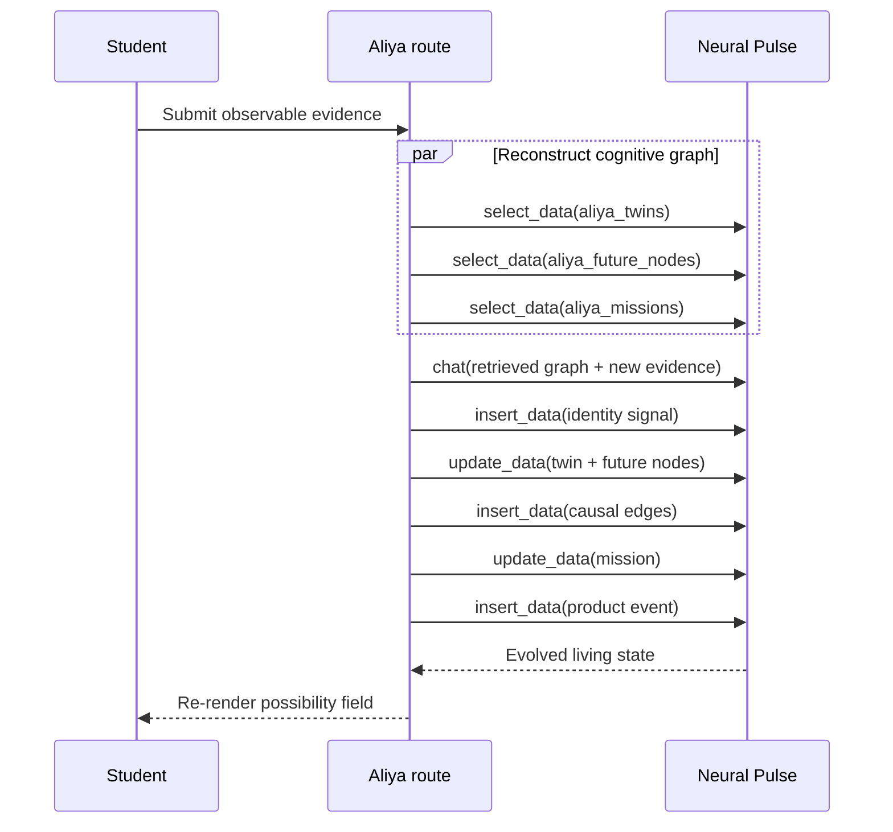

# ALIYA

> A possible-self observatory powered by the Evorozen Neural Pulse Virtual
> Database.

[Live observatory](https://aliya-jet.vercel.app) ·
[Public repository](https://github.com/Tahiram32/Aliya)

Aliya lets a student describe a future they want, then renders three divergent
possible selves as a navigable constellation. The product does not pretend to
predict destiny. It creates testable hypotheses, asks for real-world evidence,
and mutates each trajectory after every check-in.

This is a fresh codebase created on July 26, 2026 for the **Evorozen Apex:
NextGen AI Buildathon**. It contains no recycled project code and no commit
history before the competition's July 17 inception boundary.

## Why this is not another AI wrapper

Neural Pulse is not used as a chat widget attached to a conventional database.
It is Aliya's database, memory, reasoning engine, and logic router. There is no
Supabase, Firebase, SQL, or separate application datastore.

Aliya registers six structures in Neural Pulse LivingDNA:

| Virtual table | Purpose |
| --- | --- |
| `aliya_twins` | Root identity, objective, constraints, and live field note |
| `aliya_future_nodes` | Independently queryable possible selves and probabilities |
| `aliya_missions` | Evidence-producing actions and completion state |
| `aliya_identity_signals` | Real-world check-ins and observed energy |
| `aliya_causal_edges` | Explainable links between evidence and future-node deltas |
| `aliya_product_events` | Anonymous, verifiable active-user analytics |

A real check-in is an end-to-end cognitive transaction:



Reads are parallel because they are independent. Writes are deliberately
serialized: live integration testing showed that simultaneous mutations
against one virtual table can race, while ordered writes preserve every graph
record.

The implementation uses the documented single endpoint,
`POST https://pulse.evorozen.com/api/neural`, with `create_schema`,
`insert_data`, `select_data`, `update_data`, and `chat` actions. See the
[official Neural Pulse documentation](https://pulse.evorozen.com/docs).

## Product thesis

Most productivity tools model tasks. Aliya models identity formation:

1. **Observe** — capture a goal, available time, energy rhythm, and the friction
   that repeatedly breaks momentum.
2. **Branch** — Neural Pulse produces three meaningfully different futures and
   stores them as a causal graph.
3. **Act** — missions ask for concrete, observable evidence rather than
   streaks or vague self-reports.
4. **Alter** — a check-in becomes an identity signal; Neural Pulse retrieves
   the graph, explains probability deltas, and creates the next mission.

## Run locally

Requirements: Node.js 20.9+ (Node 22 recommended).

```bash
npm install
cp .env.example .env.local
npm run dev
```

Without `EVOROZEN_API_KEY`, Aliya runs in clearly labeled **Simulation /
Preview** mode. The visual experience works, but data is not persistent and it
does not satisfy the final Buildathon integration requirement.

### Connect Neural Pulse

1. Generate an API key from the
   [Evorozen Pulse dashboard](https://pulse.evorozen.com).
2. Add it to `.env.local`:

   ```bash
   EVOROZEN_API_KEY=evo_live_your_key_here
   EVOROZEN_SCHEMA_READY=false
   ```

3. Register the six-table LivingDNA once:

   ```bash
   npm run neural:bootstrap
   ```

4. After it succeeds, set `EVOROZEN_SCHEMA_READY=true` in the runtime
   environment. This avoids redundant schema registration on cold starts.
5. Restart the app. The header must read `NEURAL PULSE / LINKED`.

Never expose the key through a `NEXT_PUBLIC_` variable.

### Deploy on Vercel

Import the repository into Vercel as a Next.js project and set these runtime
variables for Production and Preview:

```text
EVOROZEN_API_KEY
EVOROZEN_API_URL=https://pulse.evorozen.com/api/neural
EVOROZEN_SCHEMA_READY=true
```

Optionally set `NEXT_PUBLIC_APP_URL` to the canonical production URL. If it is
omitted, Aliya uses Vercel's production-domain environment variable for social
metadata. The two mutation routes declare a 60-second function duration to
accommodate ordered Virtual Database writes.

The current production deployment is
[`aliya-jet.vercel.app`](https://aliya-jet.vercel.app).

## AI-gateway continuity

Every manifestation and check-in first attempts Neural Pulse's `chat` action.
If the upstream AISecurityModule blocks a benign reasoning request, Aliya uses
a bounded deterministic causal router for that observation. This is not a
database fallback: the graph is still created, retrieved, updated, and
measured exclusively through Neural Pulse, and the next observation retries
the AI action automatically.

## Quality checks

```bash
npm run typecheck
npm test
npm run build
```

`npm run check` runs all three sequentially. GitHub Actions repeats the same
quality gate for every pull request and push to `main`.

## API routes

| Route | Method | Purpose |
| --- | --- | --- |
| `/api/status` | GET | Report Neural Pulse vs simulation mode |
| `/api/manifest` | POST | Create a cognitive twin and initial graph |
| `/api/constellation` | GET | Reconstruct a graph from Neural Pulse records |
| `/api/check-in` | POST | Insert evidence and evolve the graph |
| `/api/metrics` | GET | Aggregate anonymous traction evidence |

Inputs are length-bounded with Zod, high-cost routes are rate-limited, and the
Evorozen key stays in server-only route handlers. User text is explicitly
wrapped as inert data in reasoning prompts; Neural Pulse's AISecurityModule
provides the upstream intent-security layer.

## Buildathon compliance

| Requirement | Evidence in this repository |
| --- | --- |
| Fresh codebase after July 17 | New Git history begins July 26, 2026 |
| Neural Pulse is primary | Six-table Virtual Database graph; no other DB |
| High logic complexity | Parallel graph retrieval + causal AI routing + ordered mutations |
| Clean UI/UX | Responsive original constellation interface, reduced-motion support |
| Active users | `/api/metrics` derives explorers/check-ins from Neural Pulse events |
| Public proof of work | Drafts and tracking plan in `docs/launch-plan.md` |
| Detailed documentation | README plus architecture, launch, and demo documents |
| Video demo | Timed script in `docs/demo-script.md` |

The dated integration record is in
[`docs/validation.md`](docs/validation.md). It distinguishes verified live
behavior from checks that must be repeated after an API-plan reset.

## Repository map

```text
app/api/                 Server-only product and Neural Pulse routes
components/              Observatory interface and constellation map
lib/neural-pulse.ts      Typed Neural Pulse transport + cognitive graph store
lib/schema-bootstrap.ts  LivingDNA table registration
lib/demo-engine.ts       Honest non-persistent preview mode
scripts/                 One-time Neural Pulse bootstrap
tests/                   Parser, graph, and rate-limit coverage
docs/                    Architecture, launch, and judging materials
```

## Important product boundary

Aliya is an educational reflection product. It does not provide medical or
mental-health advice and does not claim that its probability values are
scientific predictions. They are directional interface signals produced from
the user's stated goal and evidence.

## License

MIT — see [LICENSE](LICENSE).
