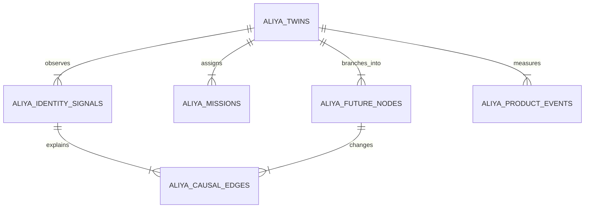

# Neural Pulse architecture

## Design constraint

The Buildathon requires Neural Pulse to replace the traditional application
database, not decorate it. Aliya therefore treats the browser as a renderer and
Next.js as a security/transport boundary. The durable application model exists
only in Evorozen.

## LivingDNA graph

The relationship is represented with explicit IDs because the public Neural
Pulse API exposes dynamic tables and structured filters rather than a
traditional foreign-key migration system.

## Neural OS request boundary

Aliya calls only `POST https://pulse.evorozen.com/api/neural`, authenticates
with a server-side Bearer token, and sends the documented
`action_type`/`prompt`/`data_payload` envelope. Neural Pulse then processes each
request through its priority-ordered Micro-Kernel:

1. `AISecurityModule` scans intent, injection patterns, and PII.
2. `DatabaseGatewayModule` validates structured operations against LivingDNA.
3. `AIGatewayModule` handles the `chat` logic-routing action.
4. `GatewayHeartbeatModule` completes response post-processing.

Aliya preserves returned trace IDs on errors so provider-side pipeline failures
can be diagnosed without exposing the API key to the browser.

## Initial manifestation

1. The user submits a bounded anonymous profile.
2. Neural Pulse's AI engine creates three divergent futures and 3–5 missions.
3. Aliya inserts one twin root.
4. Future nodes, missions, and the adoption event are inserted in order.
5. The UI receives a view model derived from the records.

## Evidence mutation

1. `select_data` retrieves the twin, nodes, and missions concurrently.
2. One `chat` call acts as the logic router over retrieved state plus new
   evidence.
3. The result must pass a strict Zod mutation contract.
4. A signal, three causal edges, updated probabilities, root state, mission
   state, and one product event are written in a deterministic order.
5. Unknown node IDs, invalid JSON, or out-of-bounds deltas fail closed.

## Efficiency decisions

- LivingDNA is registered once through `npm run neural:bootstrap`.
- `EVOROZEN_SCHEMA_READY=true` prevents repeated schema calls in production.
- Independent reads run concurrently.
- Writes are serialized because live testing found that concurrent inserts
  against the same virtual table can race and omit a sibling record.
- There is one AI routing call per manifestation or mutation.
- Mutation prompts are contract-tested to stay below the API's 2,000-character
  request ceiling.
- UI-only coordinates are stored with future nodes so reconstruction needs no
  secondary datastore.
- Adoption analytics reuse the same Virtual Database rather than adding a
  third-party analytics database.

## Simulation boundary

Simulation mode is only for public preview and local UI work before an API key
is available. It is visibly disclosed in the header and observatory. It does
not persist records, increment live metrics, or count as final Buildathon
compliance.

## AI-gateway failover

Aliya attempts one Neural Pulse `chat` action for manifestation and one for
each evidence mutation. If Evorozen's AISecurityModule rejects even benign
traffic during a provider-side incident, a bounded deterministic causal router
keeps the product available. This is not a database fallback: all twins, nodes,
missions, evidence, edges, retrieval, updates, and telemetry continue to flow
through Neural Pulse. The next observation automatically retries the Neural
Pulse AI action, and the rejected trace ID remains attached to the view model
for diagnosis.
